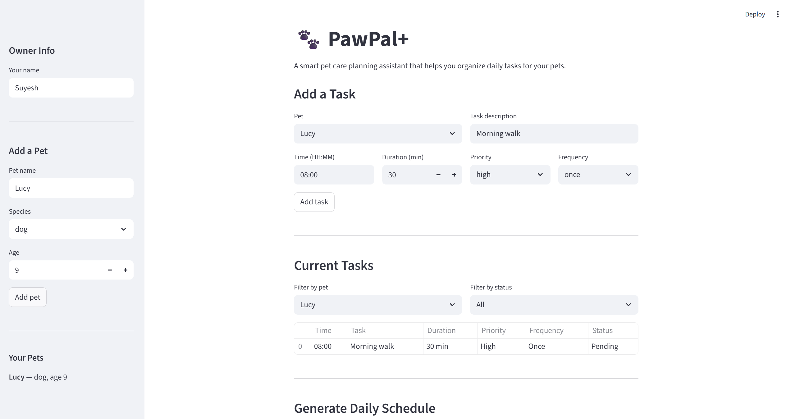

# PawPal+ (Module 2 Project)

**PawPal+** is a Streamlit app that helps pet owners plan and manage daily care tasks for their pets.

## Demo



## Scenario

A busy pet owner needs help staying consistent with pet care. They want an assistant that can:

- Track pet care tasks (walks, feeding, meds, enrichment, grooming, etc.)
- Consider constraints (time available, priority, owner preferences)
- Produce a daily plan and explain why it chose that plan

## Features

- **Multiple pets** - Add and manage several pets (dogs, cats, or other species)
- **Task management** - Create tasks with time, duration, priority, and frequency
- **Sorting by time** - Daily schedule displayed in chronological order
- **Sorting by priority** - View tasks ranked high to low
- **Filtering** - Filter tasks by pet name or completion status
- **Conflict warnings** - Detects overlapping tasks and warns the user (e.g., "Grooming 10:00-10:45 overlaps with Vet 10:30-11:30")
- **Daily recurrence** - Daily and weekly tasks auto-create their next occurrence when marked complete
- **Schedule explanations** - Each scheduled task includes reasoning about its priority and placement

## Smarter Scheduling

The `Scheduler` class provides several algorithmic features beyond basic task listing:

- **Time-based sorting** - Uses `sorted()` with a lambda key to order tasks by their `HH:MM` time strings chronologically
- **Priority sorting** - Converts string priorities ("high", "medium", "low") to numeric values (3, 2, 1) for correct ordering
- **Conflict detection** - Compares each pair of pending tasks by computing their start-to-end time windows and flagging any overlaps. Returns human-readable warning strings rather than crashing
- **Recurring task automation** - When `mark_task_complete()` is called on a daily/weekly task, it uses Python's `timedelta` to calculate the next due date and automatically adds the new task to the pet's task list
- **Filtering** - Filter by completion status (`filter_by_status`) or by pet name (`filter_by_pet`) to narrow down large task lists

## Architecture

The system is built around four classes in `pawpal_system.py`:

| Class | Responsibility |
|---|---|
| **Task** | Single care activity with time, duration, priority, frequency, and completion tracking |
| **Pet** | Pet details + owns a list of Tasks |
| **Owner** | Manages multiple Pets, aggregates all tasks |
| **Scheduler** | The brain - sorting, filtering, conflict detection, recurrence, and schedule generation |

See `uml_diagram.md` for the full Mermaid.js class diagram, or paste the Mermaid code into the [Mermaid Live Editor](https://mermaid.live) to view it.

## Getting started

### Setup

```bash
python -m venv .venv
source .venv/bin/activate  # Windows: .venv\Scripts\activate
pip install -r requirements.txt
```

### Run the app

```bash
streamlit run app.py
```

### Run the demo script

```bash
python main.py
```

## Testing PawPal+

Run the automated test suite:

```bash
python -m pytest tests/test_pawpal.py -v
```

The test suite (23 tests) covers:

- Task completion, priority values, end-time calculation
- Recurring task creation (daily and weekly)
- Pet task addition, removal, and pending-task filtering
- Owner task aggregation and pet lookup
- Scheduler sorting (by time and priority)
- Scheduler filtering (by status and pet)
- Conflict detection (overlapping, non-overlapping, and empty cases)
- Schedule generation, explanations, and summary output

**Confidence level:** 4/5 stars - all core behaviors are tested, with room to add edge cases (midnight-spanning tasks, duplicate detection, large task volumes).

## Project structure

```
pawpal-starter/
  app.py               # Streamlit UI
  pawpal_system.py      # Backend classes (Task, Pet, Owner, Scheduler)
  main.py               # Terminal demo script
  tests/
    test_pawpal.py      # Automated test suite (23 tests)
  uml_diagram.md        # Mermaid.js class diagram
  reflection.md         # Project reflection
  requirements.txt      # Python dependencies
```
