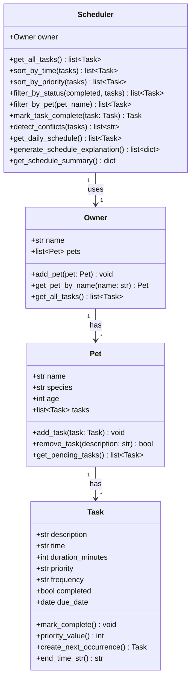

# PawPal+ UML Class Diagram

```mermaid
classDiagram
    class Task {
        +str description
        +str time
        +int duration_minutes
        +str priority
        +str frequency
        +bool completed
        +date due_date
        +mark_complete() void
        +priority_value() int
        +create_next_occurrence() Task
        +end_time_str() str
    }

    class Pet {
        +str name
        +str species
        +int age
        +list~Task~ tasks
        +add_task(task: Task) void
        +remove_task(description: str) bool
        +get_pending_tasks() list~Task~
    }

    class Owner {
        +str name
        +list~Pet~ pets
        +add_pet(pet: Pet) void
        +get_pet_by_name(name: str) Pet
        +get_all_tasks() list~Task~
    }

    class Scheduler {
        +Owner owner
        +get_all_tasks() list~Task~
        +sort_by_time(tasks) list~Task~
        +sort_by_priority(tasks) list~Task~
        +filter_by_status(completed, tasks) list~Task~
        +filter_by_pet(pet_name) list~Task~
        +mark_task_complete(task: Task) Task
        +detect_conflicts(tasks) list~str~
        +get_daily_schedule() list~Task~
        +generate_schedule_explanation() list~dict~
        +get_schedule_summary() dict
    }

    Owner "1" --> "*" Pet : has
    Pet "1" --> "*" Task : has
    Scheduler "1" --> "1" Owner : uses
```
